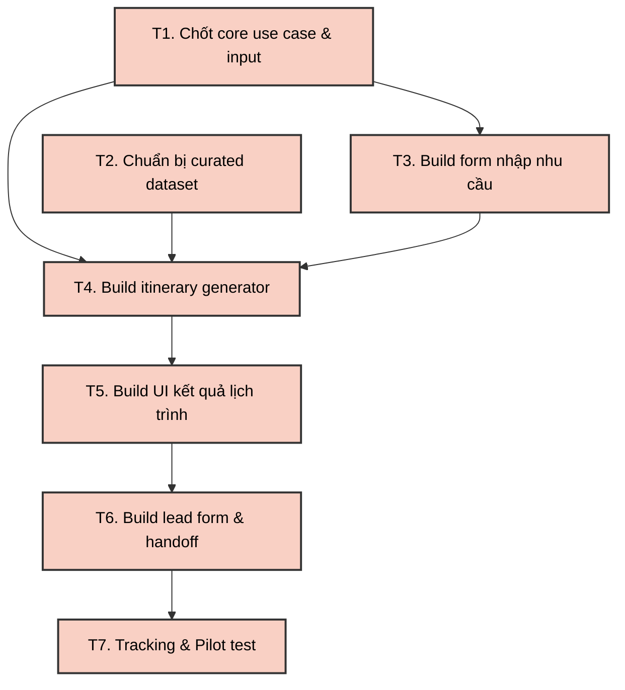

# Lab Day 25 - Workshop 4: Dependency Map & Critical Path (NiBi AI)
**Học viên:** Đặng Trần Đạt - 2A202600662

## NOW Focus
NiBi AI đang tập trung chứng minh rằng khách du lịch có thể biến nhu cầu mơ hồ thành lịch trình Ninh Bình khả thi, sau đó để lại nhu cầu tư vấn và tạo business signal có thể đo lường được.

---

## 1. 3 External Dependencies (Rủi ro ngoại cảnh)

*Chỉ tập trung vào những rủi ro có thể làm core flow cột NOW "chết" trong vòng 30 ngày.*

| External Dependency | Worst-case scenario (Kịch bản xấu nhất) | Plan B (Khắc phục trong 7 ngày) | Cost (Chi phí Plan B) |
|---|---|---|---|
| **1. LLM API Provider** *(OpenAI/Gemini/Claude)* | API bị rate limit, hết quota hoặc key bị lỗi đúng lúc demo/pilot, khiến user không tạo được lịch trình. | Chuẩn bị provider dự phòng (fallback) và lưu cache sẵn 20–30 lịch trình mẫu theo các nhu cầu phổ biến (đi 1 ngày, gia đình, cặp đôi...). | **1–2 ngày** 0–300k VND |
| **2. Dữ liệu du lịch địa phương** *(Giá, điểm đến, tuyến đường)* | AI gợi ý sai địa điểm, sai giá, sai tuyến hoặc vẽ ra lịch trình phi thực tế làm mất niềm tin của user. | Tạo một *curated dataset* tối thiểu (Google Sheet/JSON) gồm 20–30 địa điểm, 5–10 homestay/xe. Chỉ cho phép AI gợi ý trong phạm vi dữ liệu đã kiểm duyệt. | **2–3 ngày** 0–500k VND |
| **3. Hosting / Lead Storage** *(Vercel/Railway/DB)* | Website deploy lỗi hoặc form không lưu được lead, khiến sales không nhận được thông tin và team không chứng minh được business signal. | Deploy backup bản static lên GitHub Pages; lưu lead song song vào Google Sheet/Formspree/Tally để đảm bảo không mất data. | **0.5–1 ngày** 0–200k VND |

---

## 2. Critical Path (Đường găng dự án)

### Danh sách 7 Task chính cho cột NOW

| Task | Tên công việc | Mô tả ngắn | Blocking (Chặn task nào) | Nằm trên Critical Path? |
|:---:|---|---|:---:|:---:|
| **T1** | Chốt core use case & input | Xác định user nhập gì (ngày đi, số người, ngân sách, sở thích). | T3, T4 | Có |
| **T2** | Chuẩn bị curated dataset | Làm sạch dữ liệu điểm đến, tuyến đi, khoảng giá tối thiểu. | T4 | Có |
| **T3** | Build form nhập nhu cầu | UI/UX cho người dùng nhập thông tin đầu vào. | T4 | Có |
| **T4** | Build itinerary generator | AI xử lý input và dataset để sinh lịch trình cá nhân hóa. | T5, T6 | Có |
| **T5** | Build UI kết quả lịch trình | Hiển thị timeline, chi phí ước tính, lý do gợi ý và CTA. | T6, T7 | Có |
| **T6** | Build lead form & handoff | Form thu thập nhu cầu tư vấn và lưu trữ an toàn. | T7 | Có |
| **T7** | Tracking & Pilot test | Đo lường completion rate, lead conversion, satisfaction. | Learning / Launch | Có |

### Sơ đồ Critical Path

**Kết luận về Critical Path:**

Chuỗi dài nhất và bắt buộc của giai đoạn NOW là: **`T1/T2 → T3 → T4 → T5 → T6 → T7`**

Đây là chuỗi không thể cắt bỏ vì nếu thiếu bất kỳ mắt xích nào, NOW không thể chứng minh được core outcome. Ví dụ: 
- Có giao diện (T3) nhưng không có dữ liệu sạch (T2) thì AI trả lời thiếu tin cậy.
- Có lịch trình (T5) nhưng không có form thu thập (T6) thì không có tín hiệu business (lead).
- Có lead form (T6) nhưng không tracking (T7) thì không thể chứng minh với investor sản phẩm thật sự tạo ra giá trị. 

Nếu một task trong chuỗi này trễ, toàn bộ mục tiêu của cột NOW sẽ bị trễ vì sản phẩm không thể chứng minh được đủ ba outcome cốt lõi: **tạo lịch trình hữu ích, thu thập lead tư vấn, và đo lường được hiệu quả kinh doanh.**
